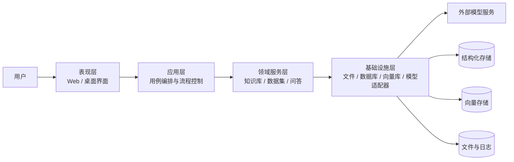

# WenKB 概要设计说明书

版本：v0.2  
日期：2026-09-02  
阶段：概要设计  
范围：本文件描述目标系统的总体架构与模块分解，不依赖具体实现代码。

## 1. 设计目的

WenKB 的概要设计目标是把需求分析阶段形成的业务能力，转化为清晰的系统架构、模块边界、数据流和质量约束，为后续详细设计与开发实现提供统一基线。

本文件强调“先需求、后实现”的软件工程顺序，因此只描述目标系统应如何组织，而不绑定当前仓库中的具体类、函数或接口文件。

## 2. 设计原则

- 需求驱动：架构必须服务于知识库导入、检索、问答与知识沉淀等核心场景。
- 分层解耦：表现层、应用层、领域服务层、基础设施层职责清晰。
- 模型可插拔：LLM 与 embedding 能力可配置、可替换、可扩展。
- 数据一致：结构化数据、向量数据、文件数据之间要保持一致性约束。
- 异步处理：索引与增强生成采用后台处理，避免阻塞主交互。
- 可追踪：任务状态、失败原因、引用来源、历史记录均可追溯。

## 3. 系统上下文

### 3.1 外部参与者

- 个人用户：导入资料、创建知识库、发起问答。
- 知识库维护者：整理目录、调整参数、维护数据质量。
- 运维/开发人员：配置模型、排查任务、维护环境。

### 3.2 外部依赖

- 大语言模型服务：用于问答、摘要、结构化抽取、提示词编排。
- 向量检索引擎：用于知识库语义检索。
- 本地文件系统：用于原始资料、日志和索引持久化。
- 关系型数据库：用于保存业务实体、状态和历史记录。

## 4. 总体架构

WenKB 采用典型的分层架构：

## 5. 分层设计

### 5.1 表现层

职责：

- 展示知识库、聊天、搜索、设置、文档与编排入口。
- 接收用户输入，发起请求，展示结果和状态。
- 负责交互体验、表单校验和页面状态管理。

### 5.2 应用层

职责：

- 将页面操作转换为业务用例。
- 组织“创建知识库”“导入资料”“构建索引”“发起问答”等流程。
- 统一处理输入校验、错误反馈和结果汇总。

### 5.3 领域服务层

职责：

- 维护知识库、数据集、聊天、搜索等核心业务规则。
- 管理状态流转、索引构建、增强生成和引用结果。
- 保证同一业务对象在数据库和向量库中的一致性。

### 5.4 基础设施层

职责：

- 提供数据库访问、文件读写、向量检索、模型调用和任务调度能力。
- 屏蔽外部组件差异，向上提供统一接口。

## 6. 核心模块

### 6.1 模型配置模块

目标：

- 支持模型供应商接入、参数配置、模型选择和首选项维护。

职责：

- 管理 LLM 与 embedding 两类模型能力。
- 保存供应商级、模型级和用户级配置。
- 为问答和增强任务提供可用模型实例。

### 6.2 知识库管理模块

目标：

- 作为用户知识资产的容器。

职责：

- 创建、编辑、删除、查询知识库。
- 维护知识库的索引模型与问答参数。
- 关联目录、数据集和对话。

### 6.3 数据集管理模块

目标：

- 管理文档与网页链接等知识源。

职责：

- 记录原始资料元数据。
- 管理启用状态、索引状态和增强状态。
- 提供分段、摘要、Q&A、三元组等二级知识对象。

### 6.4 索引构建模块

目标：

- 将原始资料转换为可检索向量索引。

职责：

- 文本切分。
- 向量化。
- 索引持久化。
- 失败记录与状态回写。

### 6.5 问答与检索模块

目标：

- 实现基于知识库的检索增强生成。

职责：

- 根据问题检索相关片段。
- 结合历史对话组织提示词。
- 调用 LLM 生成答案。
- 返回引用来源。

### 6.6 增强生成模块

目标：

- 在主索引基础上生成摘要、Q&A 和三元组等结构化知识。

职责：

- 读取切分后的文本片段。
- 批量调用 LLM 生成增强内容。
- 写回数据库并同步到向量索引。

### 6.7 搜索模块

目标：

- 提供面向知识库的语义搜索入口。

职责：

- 复用向量检索能力。
- 返回来源、相似度和文本片段。

### 6.8 文档与编排模块

目标：

- 作为后续知识加工与流程编排的扩展空间。

职责：

- 支持文档集与文档编辑。
- 支持更高层的节点式能力编排。

## 7. 关键数据流

### 7.1 模型配置流

1. 用户配置供应商和模型参数。
2. 系统保存配置并在运行时解析出可用模型。
3. 问答、搜索、摘要与抽取流程复用同一模型配置体系。

### 7.2 知识导入流

1. 用户导入文件或网页链接。
2. 系统保存原始资料和元数据。
3. 后台任务切分内容并构建索引。
4. 主索引完成后进入增强生成阶段。

### 7.3 问答流

1. 用户选择知识库并发起提问。
2. 系统根据问题检索相关内容。
3. 系统结合历史上下文调用 LLM。
4. 系统流式返回答案和引用。

### 7.4 搜索流

1. 用户输入查询条件。
2. 系统在知识库向量索引中检索匹配内容。
3. 返回结构化搜索结果。

## 8. 状态模型

### 8.1 数据集状态

- 启用状态：`enb` / `une`
- 主索引状态：`new` / `order` / `index` / `ready` / `error`
- 摘要状态：同上
- Q&A 状态：同上
- 三元组状态：同上

### 8.2 对话状态

- 按最后更新时间排序。
- 首条消息可用于自动命名。
- 支持重新生成、删除和历史回溯。

## 9. 质量属性

### 9.1 可用性

- 关键流程应有明确状态反馈。
- 失败应能定位到具体业务对象。

### 9.2 性能

- 导入和增强任务应异步执行。
- 问答结果应采用流式输出。

### 9.3 可靠性

- 单个任务失败不应拖垮主服务。
- 状态回写应保证最终一致性。

### 9.4 可扩展性

- 模型、文件类型、向量库和增强策略应可扩展。
- 后续可增加更多资料类型和多知识库协同能力。

### 9.5 可维护性

- 模块边界清晰，减少跨层依赖。
- 业务规则、配置和持久化逻辑分离。

## 10. 部署视角

WenKB 的目标部署形态可分为：

- 单机桌面模式：前端与后端本地运行。
- 本地服务模式：前端浏览器访问本地后端。
- 后续可演进为局域网部署或私有化部署。

部署时需要关注：

- 数据库文件位置。
- 向量库持久化位置。
- 模型服务可达性。
- 本地文件读写权限。

## 11. 与需求文档的关系

本概要设计严格遵循需求分析文档中的功能边界与非功能要求：

- 需求分析定义“做什么”。
- 概要设计定义“怎么分层组织”。
- 详细设计再进一步定义“怎么实现”。

因此，本文件不绑定具体类、函数、路由或代码文件；这些内容应留到详细设计阶段再展开。

## 12. 后续设计输出

建议下一步补充：

1. 详细设计说明书
2. 数据库设计说明书
3. 接口设计说明书
4. 状态机设计说明
5. 错误码与异常规范
6. 测试计划与测试用例
7. 部署运维手册

## 13. 验收标准

概要设计文档应满足：

- 能描述系统分层和模块边界。
- 能描述核心数据流与状态流转。
- 能描述主要质量属性和部署形态。
- 能作为详细设计和实现阶段的基线。
- 不依赖具体代码文件即可独立阅读与评审。

