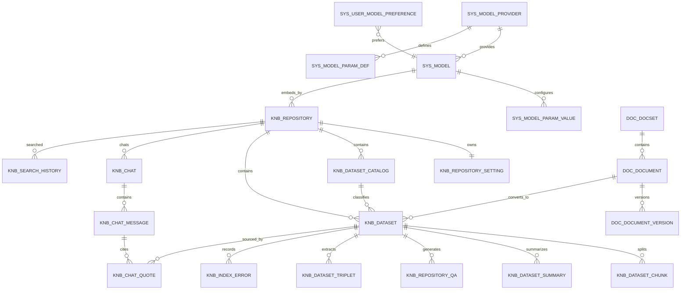

# WenKB 数据库设计说明书

版本：v0.1  
日期：2026-09-02  
阶段：数据库设计  
范围：本文件基于需求分析、概要设计与详细设计文档，描述目标产品的关系型数据模型、向量数据映射、文件数据映射与一致性约束，不以当前项目代码作为设计依据。

## 1. 文档目的

本文用于把 WenKB 目标产品中的核心数据对象转化为可落地的数据存储设计，为后续接口设计、编码实现、测试计划、部署运维和数据迁移提供基线。

数据库设计关注以下问题：

- 哪些业务对象需要持久化。
- 各对象之间如何关联。
- 主键、外键、唯一性、状态字段和审计字段如何约束。
- 关系型数据库、向量库和文件系统之间如何保持一致。
- 后续扩展权限、标签、多知识库问答和应用编排时预留哪些数据边界。

## 2. 设计依据

- 需求分析说明书
- 概要设计说明书
- 详细设计说明书
- 操作文档中的运行流程和业务状态说明

本文件遵循“需求分析与概要设计作为目标产品基线，详细设计阶段补充实现映射”的原则。表结构命名可以作为后续实现参考，但不得反向以既有实现限制目标产品的数据设计。

## 3. 存储范围

### 3.1 关系型数据库

关系型数据库保存可事务化、可查询、可审计的业务数据，包括：

- 模型供应商、模型、模型参数、用户模型首选项。
- 知识库、知识库设置、数据集目录、数据集元数据。
- 文档分段、摘要、Q&A、三元组、索引错误。
- 对话、消息、引用、搜索历史。
- 文档集、文档、文档版本。
- 系统枚举、文件元数据、数据库版本。

### 3.2 向量数据库

向量数据库保存可语义检索的向量索引，包括：

- 文档分段向量。
- 摘要向量。
- Q&A 向量。
- 三元组向量。

向量库不作为业务主数据来源。业务对象的生命周期、状态、权限和展示信息以关系型数据库为准。

### 3.3 文件系统

文件系统保存用户上传的原始资料、解析中间文件、日志和向量库持久化文件。关系型数据库只保存文件元数据、访问路径、校验摘要和业务归属。

## 4. 设计原则

- 主数据明确：知识库、数据集、文档、对话等对象必须有稳定主键。
- 状态可追踪：索引、摘要、Q&A、三元组任务状态必须可查询、可重试。
- 来源可回溯：问答引用必须能回到数据集、文件类型和原始片段。
- 敏感数据保护：API Key 等模型参数必须标识加密状态，回显时脱敏。
- 结构化与向量分离：关系库保存业务事实，向量库保存检索索引。
- 最终一致：关系库与向量库写入失败时必须具备重试与修复入口。
- 可演进：表结构为团队协作、多知识库检索、标签、应用编排预留扩展空间。

## 5. 命名与字段约定

### 5.1 表命名

表名采用业务域前缀：

| 前缀 | 含义 | 示例 |
|---|---|---|
| `t_sys_` | 系统与模型配置 | `t_sys_model_provider` |
| `t_knb_` | 知识库业务 | `t_knb_repository` |
| `t_doc_` | 文档集业务 | `t_doc_document` |
| `t_app_` | 应用编排业务预留 | `t_app_workflow` |

### 5.2 主键约定

- 业务主键统一使用字符串 ID，建议长度 32 或 36。
- ID 应由服务端生成，前端不得自行决定业务主键。
- 多字段唯一对象可以使用联合唯一索引，不建议用联合主键承载复杂业务含义。

### 5.3 审计字段约定

需要审计的表建议统一包含：

| 字段 | 含义 |
|---|---|
| `created_by` | 创建人 |
| `created_at` | 创建时间 |
| `updated_by` | 最后修改人 |
| `updated_at` | 最后修改时间 |
| `deleted_at` | 软删除时间，非必需 |

当前单机形态可以使用默认用户，但字段设计应保留后续多用户扩展能力。

### 5.4 状态字段约定

状态字段使用短编码保存，界面展示通过枚举映射完成。

| 状态域 | 可选值 | 含义 |
|---|---|---|
| 启用状态 | `enb` / `une` | 已启用 / 未启用 |
| 索引状态 | `new` / `order` / `index` / `ready` / `error` | 待处理 / 已排队 / 处理中 / 已完成 / 失败 |
| 增强状态 | `nobd` / `new` / `order` / `index` / `ready` / `error` | 未构建 / 待处理 / 已排队 / 处理中 / 已完成 / 失败 |
| 消息角色 | `user` / `assistant` / `system` | 用户 / 助手 / 系统 |
| 生成来源 | `auto` / `manual` | 自动生成 / 人工维护 |

## 6. 逻辑 ER 关系

## 7. 表清单

| 业务域 | 表名 | 说明 |
|---|---|---|
| 系统配置 | `t_sys_schema_version` | 数据库版本记录 |
| 系统配置 | `t_sys_file` | 文件元数据 |
| 模型配置 | `t_sys_model_provider` | 模型供应商 |
| 模型配置 | `t_sys_model_param_def` | 供应商或模型参数定义 |
| 模型配置 | `t_sys_model` | 模型实例 |
| 模型配置 | `t_sys_model_param_value` | 用户模型参数值 |
| 模型配置 | `t_sys_user_model_preference` | 用户模型首选项 |
| 知识库 | `t_knb_repository` | 知识库 |
| 知识库 | `t_knb_repository_setting` | 知识库问答参数 |
| 知识库 | `t_knb_dataset_catalog` | 数据集目录 |
| 知识库 | `t_knb_dataset` | 数据集 |
| 知识库 | `t_knb_dataset_chunk` | 文档分段 |
| 知识增强 | `t_knb_dataset_summary` | 摘要 |
| 知识增强 | `t_knb_repository_qa` | Q&A |
| 知识增强 | `t_knb_dataset_triplet` | 三元组 |
| 知识增强 | `t_knb_index_error` | 索引与增强错误 |
| 聊天问答 | `t_knb_chat` | 对话 |
| 聊天问答 | `t_knb_chat_message` | 消息 |
| 聊天问答 | `t_knb_chat_quote` | 引用来源 |
| 搜索 | `t_knb_search_history` | 搜索历史 |
| 文档集 | `t_doc_docset` | 文档集 |
| 文档集 | `t_doc_document` | 文档 |
| 文档集 | `t_doc_document_version` | 文档版本 |

## 8. 系统与模型配置表

### 8.1 数据库版本表 `t_sys_schema_version`

| 字段 | 类型 | 约束 | 说明 |
|---|---|---|---|
| `version_id` | varchar(32) | PK | 版本记录 ID |
| `version_no` | integer | unique, not null | 数据库版本号 |
| `applied_at` | datetime | not null | 应用时间 |
| `remark` | varchar(1000) |  | 说明 |

### 8.2 文件表 `t_sys_file`

| 字段 | 类型 | 约束 | 说明 |
|---|---|---|---|
| `file_id` | varchar(32) | PK | 文件 ID |
| `file_name` | varchar(200) | not null | 原始文件名 |
| `file_path` | varchar(500) | not null | 本地保存路径 |
| `file_type` | varchar(20) | not null | 文件扩展或媒体类型 |
| `file_size` | integer |  | 文件大小 |
| `md5_hex` | varchar(32) |  | MD5 摘要 |
| `sha1_hex` | varchar(40) |  | SHA1 摘要 |
| `file_url` | varchar(500) |  | 访问地址或静态资源地址 |
| `created_by` | varchar(32) |  | 创建人 |
| `created_at` | datetime | not null | 创建时间 |

索引建议：

- `idx_sys_file_hash`：`md5_hex`, `sha1_hex`，用于重复文件识别。
- `idx_sys_file_owner_time`：`created_by`, `created_at`，用于用户文件列表。

### 8.3 模型供应商表 `t_sys_model_provider`

| 字段 | 类型 | 约束 | 说明 |
|---|---|---|---|
| `provider_id` | varchar(100) | PK | 供应商 ID |
| `provider_name` | varchar(200) | not null | 供应商名称 |
| `provider_desc` | varchar(2000) |  | 供应商说明 |
| `provider_icon` | varchar(1000) |  | 图标路径 |
| `supported_types` | varchar(200) | not null | 支持的模型类型，多个值逗号分隔 |
| `enabled` | char(1) | default `Y` | 是否启用 |

### 8.4 模型参数定义表 `t_sys_model_param_def`

| 字段 | 类型 | 约束 | 说明 |
|---|---|---|---|
| `param_def_id` | varchar(32) | PK | 参数定义 ID |
| `provider_id` | varchar(100) | FK | 供应商 ID |
| `param_code` | varchar(100) | not null | 参数编码 |
| `param_name` | varchar(200) | not null | 参数名称 |
| `param_desc` | varchar(2000) |  | 参数说明 |
| `default_value` | varchar(2000) |  | 默认值 |
| `param_level` | varchar(20) | not null | `provider` / `model` / `both` |
| `model_type` | varchar(100) |  | 适用模型类型 |
| `required` | char(1) | default `N` | 是否必填 |
| `encrypted_required` | char(1) | default `N` | 是否要求加密 |
| `option_values` | varchar(1000) |  | 可选枚举 |
| `sort_order` | integer |  | 展示顺序 |

约束建议：

- 唯一约束：`provider_id`, `param_code`, `param_level`, `model_type`。
- 密钥类字段必须将 `encrypted_required` 设为 `Y`。

### 8.5 模型表 `t_sys_model`

| 字段 | 类型 | 约束 | 说明 |
|---|---|---|---|
| `model_id` | varchar(32) | PK | 模型 ID |
| `provider_id` | varchar(100) | FK, not null | 供应商 ID |
| `model_name` | varchar(200) | not null | 模型名称 |
| `model_type` | varchar(100) | not null | `llm` / `text-embedding` / `tts` 等 |
| `model_icon` | varchar(1000) |  | 图标路径 |
| `built_in` | char(1) | default `N` | 是否内置 |
| `owner_user_id` | varchar(32) |  | 自定义模型所属用户 |
| `enabled` | char(1) | default `Y` | 是否启用 |

索引建议：

- `idx_sys_model_provider_type`：`provider_id`, `model_type`。
- 唯一约束：`provider_id`, `model_name`, `owner_user_id`。

### 8.6 模型参数值表 `t_sys_model_param_value`

| 字段 | 类型 | 约束 | 说明 |
|---|---|---|---|
| `param_value_id` | varchar(32) | PK | 参数值 ID |
| `provider_id` | varchar(100) | FK, not null | 供应商 ID |
| `model_id` | varchar(32) | FK | 模型 ID |
| `user_id` | varchar(32) | not null | 用户 ID |
| `param_code` | varchar(100) | not null | 参数编码 |
| `param_value` | varchar(2000) |  | 参数值 |
| `value_encrypted` | char(1) | default `N` | 是否已加密 |
| `updated_at` | datetime | not null | 更新时间 |

约束建议：

- 唯一约束：`provider_id`, `model_id`, `user_id`, `param_code`。
- 当参数定义要求加密时，`value_encrypted` 必须为 `Y`。

### 8.7 用户模型首选项表 `t_sys_user_model_preference`

| 字段 | 类型 | 约束 | 说明 |
|---|---|---|---|
| `user_id` | varchar(32) | PK | 用户 ID |
| `llm_model_id` | varchar(32) | FK | 默认聊天模型 |
| `embedding_model_id` | varchar(32) | FK | 默认 embedding 模型 |
| `updated_at` | datetime | not null | 更新时间 |

规则：

- 未配置默认 LLM 时，问答流程应返回明确提示。
- 知识库创建时可读取默认 embedding 模型作为推荐值，但最终以知识库绑定模型为准。

## 9. 知识库核心表

### 9.1 知识库表 `t_knb_repository`

| 字段 | 类型 | 约束 | 说明 |
|---|---|---|---|
| `repository_id` | varchar(32) | PK | 知识库 ID |
| `repository_name` | varchar(200) | not null | 知识库名称 |
| `repository_desc` | varchar(2000) |  | 知识库介绍 |
| `repository_icon` | varchar(500) |  | 图标 |
| `repository_type` | varchar(20) |  | 类型预留 |
| `visibility` | varchar(20) | default `private` | 权限范围 |
| `embedding_model_id` | varchar(32) | FK, not null | 绑定的 embedding 模型 |
| `created_by` | varchar(32) | not null | 创建人 |
| `created_at` | datetime | not null | 创建时间 |
| `updated_at` | datetime |  | 更新时间 |

索引建议：

- `idx_knb_repository_owner_time`：`created_by`, `created_at`。
- `idx_knb_repository_embedding_model`：`embedding_model_id`。

规则：

- 创建知识库必须选择 embedding 模型。
- 当知识库已有向量索引时，修改 embedding 模型必须触发重建提示或重建任务。

### 9.2 知识库设置表 `t_knb_repository_setting`

| 字段 | 类型 | 约束 | 说明 |
|---|---|---|---|
| `repository_id` | varchar(32) | PK, FK | 知识库 ID |
| `max_context_chunks` | integer | not null | 最大上下文片段数 |
| `max_history_turns` | integer | not null | 最大历史轮数 |
| `llm_temperature` | decimal(4,2) | not null | 温度 |
| `similarity_threshold` | decimal(5,4) | not null | 相似度阈值 |
| `top_k` | integer | not null | 检索候选数量 |
| `updated_at` | datetime | not null | 更新时间 |

默认值建议：

| 字段 | 默认值 | 合法范围 |
|---|---:|---|
| `max_context_chunks` | 5 | 1-50 |
| `max_history_turns` | 3 | 0-20 |
| `llm_temperature` | 0.70 | 0-2 |
| `similarity_threshold` | 0.30 | 0-1 |
| `top_k` | 10 | 1-100 |

### 9.3 数据集目录表 `t_knb_dataset_catalog`

| 字段 | 类型 | 约束 | 说明 |
|---|---|---|---|
| `catalog_id` | varchar(32) | PK | 目录 ID |
| `parent_catalog_id` | varchar(32) | FK | 父目录 ID |
| `repository_id` | varchar(32) | FK, not null | 知识库 ID |
| `catalog_name` | varchar(200) | not null | 目录名称 |
| `catalog_desc` | varchar(2000) |  | 目录说明 |
| `catalog_path` | varchar(1000) |  | 目录路径 |
| `sort_order` | integer | default 0 | 排序 |
| `created_at` | datetime | not null | 创建时间 |

规则：

- 删除目录时不删除数据集，数据集的 `catalog_id` 置空。
- 同一父目录下目录名称应保持唯一。

### 9.4 数据集表 `t_knb_dataset`

| 字段 | 类型 | 约束 | 说明 |
|---|---|---|---|
| `dataset_id` | varchar(32) | PK | 数据集 ID |
| `repository_id` | varchar(32) | FK, not null | 知识库 ID |
| `catalog_id` | varchar(32) | FK | 所属目录 |
| `dataset_name` | varchar(200) | not null | 数据集名称 |
| `dataset_type` | varchar(20) | not null | 文件、网页、文档等 |
| `source_type` | varchar(20) | not null | `file` / `url` / `doc` |
| `source_url` | varchar(1000) |  | 网页链接 |
| `file_id` | varchar(32) | FK | 文件 ID |
| `file_name` | varchar(200) |  | 文件名 |
| `file_type` | varchar(20) |  | 文件类型 |
| `file_path` | varchar(500) |  | 文件路径 |
| `doc_id` | varchar(32) | FK | 来源文档 ID |
| `doc_version_id` | varchar(32) | FK | 来源文档版本 ID |
| `enabled_status` | varchar(10) | not null | 启用状态 |
| `index_status` | varchar(10) | not null | 主索引状态 |
| `summary_status` | varchar(10) | not null | 摘要状态 |
| `qa_status` | varchar(10) | not null | Q&A 状态 |
| `triplet_status` | varchar(10) | not null | 三元组状态 |
| `created_by` | varchar(32) | not null | 创建人 |
| `created_at` | datetime | not null | 创建时间 |
| `updated_at` | datetime |  | 更新时间 |

索引建议：

- `idx_knb_dataset_repo_status`：`repository_id`, `enabled_status`, `index_status`。
- `idx_knb_dataset_enhance_status`：`repository_id`, `summary_status`, `qa_status`, `triplet_status`。
- `idx_knb_dataset_catalog`：`catalog_id`。
- `idx_knb_dataset_doc`：`doc_id`, `doc_version_id`。

规则：

- 新导入文件默认进入待索引状态，但只有启用后才进入后台索引队列。
- 网页链接解析失败时，数据集保留记录并写入错误表。
- 删除数据集时必须同步删除分段、摘要、Q&A、三元组、错误记录和向量索引。

### 9.5 分段表 `t_knb_dataset_chunk`

| 字段 | 类型 | 约束 | 说明 |
|---|---|---|---|
| `chunk_id` | varchar(32) | PK | 分段 ID |
| `dataset_id` | varchar(32) | FK, not null | 数据集 ID |
| `repository_id` | varchar(32) | FK, not null | 知识库 ID |
| `chunk_seq` | integer | not null | 分段序号 |
| `chunk_content` | text | not null | 分段正文 |
| `chunk_assist` | text |  | 辅助文本或解析信息 |
| `token_count` | integer |  | 估算 token 数 |
| `vector_status` | varchar(10) | default `new` | 向量同步状态 |
| `created_at` | datetime | not null | 创建时间 |
| `updated_at` | datetime |  | 更新时间 |

约束建议：

- 唯一约束：`dataset_id`, `chunk_seq`。
- 索引：`repository_id`, `dataset_id`。

规则：

- 分段是主索引的最小关系库对象。
- 分段内容修改后，必须将对应向量记录标记为待更新并重新写入向量库。

## 10. 知识增强表

### 10.1 摘要表 `t_knb_dataset_summary`

| 字段 | 类型 | 约束 | 说明 |
|---|---|---|---|
| `summary_id` | varchar(32) | PK | 摘要 ID |
| `dataset_id` | varchar(32) | FK, not null | 数据集 ID |
| `repository_id` | varchar(32) | FK, not null | 知识库 ID |
| `summary_seq` | integer | not null | 摘要序号 |
| `summary_content` | text | not null | 摘要内容 |
| `summary_source` | varchar(20) | not null | `auto` / `manual` |
| `vector_status` | varchar(10) | default `new` | 向量同步状态 |
| `created_by` | varchar(32) |  | 创建人 |
| `created_at` | datetime | not null | 创建时间 |
| `updated_at` | datetime |  | 更新时间 |

### 10.2 Q&A 表 `t_knb_repository_qa`

| 字段 | 类型 | 约束 | 说明 |
|---|---|---|---|
| `qa_id` | varchar(32) | PK | Q&A ID |
| `repository_id` | varchar(32) | FK, not null | 知识库 ID |
| `dataset_id` | varchar(32) | FK | 数据集 ID |
| `question` | varchar(2000) | not null | 问题 |
| `answer` | text | not null | 答案 |
| `qa_source` | varchar(20) | not null | `auto` / `manual` |
| `vector_status` | varchar(10) | default `new` | 向量同步状态 |
| `created_by` | varchar(32) |  | 创建人 |
| `created_at` | datetime | not null | 创建时间 |
| `updated_at` | datetime |  | 更新时间 |

索引建议：

- `idx_knb_qa_repo_dataset`：`repository_id`, `dataset_id`。
- `idx_knb_qa_source`：`qa_source`。

规则：

- 人工 Q&A 可不绑定具体数据集，但必须绑定知识库。
- 自动 Q&A 应绑定来源数据集，便于删除和重建。

### 10.3 三元组表 `t_knb_dataset_triplet`

| 字段 | 类型 | 约束 | 说明 |
|---|---|---|---|
| `triplet_id` | varchar(32) | PK | 三元组 ID |
| `repository_id` | varchar(32) | FK, not null | 知识库 ID |
| `dataset_id` | varchar(32) | FK, not null | 数据集 ID |
| `triplet_seq` | integer | not null | 序号 |
| `subject` | varchar(1000) | not null | 主体 |
| `predicate` | varchar(1000) | not null | 关系 |
| `object` | varchar(1000) | not null | 客体 |
| `triplet_source` | varchar(20) | not null | `auto` / `manual` |
| `vector_status` | varchar(10) | default `new` | 向量同步状态 |
| `created_by` | varchar(32) |  | 创建人 |
| `created_at` | datetime | not null | 创建时间 |
| `updated_at` | datetime |  | 更新时间 |

约束建议：

- 唯一约束：`dataset_id`, `subject`, `predicate`, `object`。

### 10.4 索引错误表 `t_knb_index_error`

| 字段 | 类型 | 约束 | 说明 |
|---|---|---|---|
| `error_id` | varchar(32) | PK | 错误 ID |
| `dataset_id` | varchar(32) | FK, not null | 数据集 ID |
| `repository_id` | varchar(32) | FK, not null | 知识库 ID |
| `index_type` | varchar(20) | not null | `main` / `summary` / `qa` / `triplet` |
| `error_message` | text | not null | 错误信息 |
| `error_context` | text |  | 错误上下文 |
| `created_at` | datetime | not null | 发生时间 |
| `resolved_at` | datetime |  | 解决时间 |

索引建议：

- `idx_knb_error_dataset_type`：`dataset_id`, `index_type`, `created_at`。

规则：

- 同一数据集同一任务类型可保留多条错误记录，便于追踪重试历史。
- 当前有效错误以 `resolved_at is null` 判断。

## 11. 聊天与搜索表

### 11.1 对话表 `t_knb_chat`

| 字段 | 类型 | 约束 | 说明 |
|---|---|---|---|
| `chat_id` | varchar(32) | PK | 对话 ID |
| `repository_id` | varchar(32) | FK, not null | 知识库 ID |
| `chat_title` | varchar(200) | not null | 对话标题 |
| `chat_status` | varchar(20) | default `active` | 对话状态 |
| `created_by` | varchar(32) | not null | 创建人 |
| `created_at` | datetime | not null | 创建时间 |
| `last_message_at` | datetime |  | 最近消息时间 |

索引建议：

- `idx_knb_chat_owner_repo_time`：`created_by`, `repository_id`, `last_message_at`。

### 11.2 消息表 `t_knb_chat_message`

| 字段 | 类型 | 约束 | 说明 |
|---|---|---|---|
| `message_id` | varchar(32) | PK | 消息 ID |
| `parent_message_id` | varchar(32) | FK | 父消息 ID |
| `chat_id` | varchar(32) | FK, not null | 对话 ID |
| `repository_id` | varchar(32) | FK, not null | 知识库 ID |
| `message_type` | varchar(20) | not null | 普通、重试、错误等 |
| `role` | varchar(20) | not null | `user` / `assistant` / `system` |
| `content` | text | not null | 消息内容 |
| `model_id` | varchar(32) | FK | 生成消息使用的模型 |
| `created_by` | varchar(32) |  | 创建人 |
| `created_at` | datetime | not null | 创建时间 |

索引建议：

- `idx_knb_message_chat_time`：`chat_id`, `created_at`。
- `idx_knb_message_parent`：`parent_message_id`。

规则：

- 重新生成答案时，新助手消息通过 `parent_message_id` 关联原用户问题或上一版本回答。
- 流式生成中的中间状态不必逐 token 落库，最终内容必须保存。

### 11.3 引用表 `t_knb_chat_quote`

| 字段 | 类型 | 约束 | 说明 |
|---|---|---|---|
| `quote_id` | varchar(32) | PK | 引用 ID |
| `message_id` | varchar(32) | FK, not null | 助手消息 ID |
| `repository_id` | varchar(32) | FK, not null | 知识库 ID |
| `dataset_id` | varchar(32) | FK | 数据集 ID |
| `chunk_id` | varchar(32) | FK | 分段 ID |
| `source_object_type` | varchar(20) | not null | `chunk` / `summary` / `qa` / `triplet` |
| `source_object_id` | varchar(32) |  | 来源对象 ID |
| `dataset_name` | varchar(200) |  | 冗余数据集名称 |
| `file_name` | varchar(200) |  | 冗余文件名 |
| `file_type` | varchar(20) |  | 冗余文件类型 |
| `score` | decimal(8,6) |  | 相似度分数 |
| `content` | text | not null | 引用片段内容 |
| `quote_order` | integer | not null | 展示顺序 |
| `created_at` | datetime | not null | 创建时间 |

索引建议：

- `idx_knb_quote_message_order`：`message_id`, `quote_order`。
- `idx_knb_quote_dataset`：`dataset_id`。

规则：

- 引用表保存问答当时的片段快照，即使后续分段被编辑，历史答案仍可回溯当时依据。
- 冗余字段用于保障历史展示稳定性，主数据仍以数据集和分段表为准。

### 11.4 搜索历史表 `t_knb_search_history`

| 字段 | 类型 | 约束 | 说明 |
|---|---|---|---|
| `search_id` | varchar(32) | PK | 搜索记录 ID |
| `repository_id` | varchar(32) | FK | 知识库 ID |
| `search_text` | varchar(2000) | not null | 搜索内容 |
| `search_type` | varchar(20) | not null | 语义、关键词等 |
| `created_by` | varchar(32) | not null | 搜索用户 |
| `searched_at` | datetime | not null | 搜索时间 |

索引建议：

- `idx_knb_search_owner_repo_time`：`created_by`, `repository_id`, `searched_at`。

## 12. 文档集表

### 12.1 文档集表 `t_doc_docset`

| 字段 | 类型 | 约束 | 说明 |
|---|---|---|---|
| `docset_id` | varchar(32) | PK | 文档集 ID |
| `docset_name` | varchar(200) | not null | 文档集名称 |
| `docset_desc` | varchar(2000) |  | 文档集说明 |
| `docset_icon` | varchar(500) |  | 图标 |
| `visibility` | varchar(20) | default `private` | 权限范围 |
| `created_by` | varchar(32) | not null | 创建人 |
| `created_at` | datetime | not null | 创建时间 |
| `updated_at` | datetime |  | 更新时间 |

### 12.2 文档表 `t_doc_document`

| 字段 | 类型 | 约束 | 说明 |
|---|---|---|---|
| `document_id` | varchar(32) | PK | 文档 ID |
| `docset_id` | varchar(32) | FK, not null | 文档集 ID |
| `parent_document_id` | varchar(32) | FK | 父文档 ID |
| `document_title` | varchar(200) | not null | 文档标题 |
| `document_type` | varchar(20) | not null | Markdown、富文本等 |
| `document_status` | varchar(20) | not null | 草稿、发布、删除等 |
| `document_content` | text |  | 当前内容 |
| `document_path` | varchar(1000) |  | 层级路径 |
| `created_by` | varchar(32) | not null | 创建人 |
| `created_at` | datetime | not null | 创建时间 |
| `updated_at` | datetime |  | 更新时间 |

索引建议：

- `idx_doc_document_set_path`：`docset_id`, `document_path`。

### 12.3 文档版本表 `t_doc_document_version`

| 字段 | 类型 | 约束 | 说明 |
|---|---|---|---|
| `version_id` | varchar(32) | PK | 版本 ID |
| `document_id` | varchar(32) | FK, not null | 文档 ID |
| `docset_id` | varchar(32) | FK, not null | 文档集 ID |
| `document_title` | varchar(200) | not null | 文档标题快照 |
| `document_type` | varchar(20) | not null | 文档类型 |
| `document_content` | text | not null | 文档内容快照 |
| `version_no` | integer | not null | 版本号 |
| `created_by` | varchar(32) | not null | 创建人 |
| `created_at` | datetime | not null | 创建时间 |

约束建议：

- 唯一约束：`document_id`, `version_no`。

规则：

- 文档转数据集时，数据集应记录来源 `document_id` 与 `version_id`。
- 文档内容更新不应自动改变已转入知识库的数据集，除非用户触发同步或重建。

## 13. 向量库映射设计

### 13.1 Collection 设计

建议按知识库建立向量集合：

| Collection | 说明 |
|---|---|
| `knb_repository_{repository_id}` | 指定知识库的全部可检索向量 |

每条向量记录应包含：

| 元数据 | 说明 |
|---|---|
| `repository_id` | 知识库 ID |
| `dataset_id` | 数据集 ID |
| `object_type` | `chunk` / `summary` / `qa` / `triplet` |
| `object_id` | 关系库对象 ID |
| `file_name` | 文件名 |
| `file_type` | 文件类型 |
| `source_name` | 数据集名称或网页标题 |
| `chunk_seq` | 分段序号，非分段可为空 |

### 13.2 向量记录 ID

向量记录 ID 建议使用稳定组合：

| 对象类型 | 向量 ID 格式 |
|---|---|
| 分段 | `chunk:{chunk_id}` |
| 摘要 | `summary:{summary_id}` |
| Q&A | `qa:{qa_id}` |
| 三元组 | `triplet:{triplet_id}` |

规则：

- 关系库对象更新时，以相同向量 ID 覆盖写入。
- 关系库对象删除时，以向量 ID 精确删除。
- 向量库重建时，以关系库 `ready` 状态对象为基准重新生成。

## 14. 事务与一致性规则

### 14.1 单事务规则

以下操作应在关系型数据库单事务内完成：

- 创建知识库与初始化知识库设置。
- 保存数据集与文件元数据。
- 新建对话与保存用户消息。
- 文档更新与生成文档版本。

### 14.2 数据库与向量库一致性

关系库与向量库无法天然处于同一事务，因此采用最终一致策略：

1. 先写入或更新关系库对象。
2. 将对象向量状态标记为待同步。
3. 后台任务写入向量库。
4. 写入成功后更新对象向量状态或任务状态。
5. 写入失败时记录错误并允许重试。

### 14.3 删除规则

| 删除对象 | 关系库动作 | 向量库动作 |
|---|---|---|
| 知识库 | 删除设置、目录、数据集、聊天、搜索记录 | 删除知识库 Collection |
| 数据集 | 删除分段、摘要、自动 Q&A、三元组、错误 | 删除该数据集全部向量 |
| 分段 | 删除分段记录 | 删除 `chunk:{chunk_id}` |
| 摘要 | 删除摘要记录 | 删除 `summary:{summary_id}` |
| Q&A | 删除 Q&A 记录 | 删除 `qa:{qa_id}` |
| 三元组 | 删除三元组记录 | 删除 `triplet:{triplet_id}` |

历史引用不随来源对象硬删除而删除，以保障历史问答可回溯。

## 15. 状态流转规则

### 15.1 主索引状态

| 当前状态 | 允许迁移到 | 触发条件 |
|---|---|---|
| `new` | `order` | 启用数据集被后台扫描 |
| `order` | `index` | 任务开始执行 |
| `index` | `ready` | 分段和向量写入成功 |
| `index` | `error` | 解析、切分、向量写入失败 |
| `ready` | `new` | 用户触发重建 |
| `error` | `new` | 用户修复后重试 |

### 15.2 增强状态

摘要、Q&A、三元组分别维护状态，流转规则与主索引一致。增强任务只能在主索引为 `ready` 后触发。

### 15.3 消息与引用状态

- 用户消息保存成功后才能触发助手回答。
- 助手回答完成后保存最终消息内容。
- 引用可以在回答前或回答后保存，但必须关联最终助手消息。
- 回答失败时应保存错误消息或错误状态，便于用户重试。

## 16. 安全与隐私设计

- 模型参数定义中标记为敏感的字段必须加密存储。
- 模型参数接口回显时不得返回密文原值，应返回空值或脱敏值。
- 文件路径仅供后端读取，不应直接暴露本机绝对路径给不可信客户端。
- 后续引入团队协作时，知识库、文档集、文件和聊天记录必须通过权限范围过滤。
- 搜索历史和聊天消息属于用户行为数据，应支持按用户清理。

## 17. 性能设计

### 17.1 常用查询索引

| 场景 | 建议索引 |
|---|---|
| 知识库列表 | `created_by`, `created_at` |
| 数据集队列扫描 | `enabled_status`, `index_status`, `created_at` |
| 增强队列扫描 | `summary_status`, `qa_status`, `triplet_status` |
| 数据集详情分段分页 | `dataset_id`, `chunk_seq` |
| 对话列表 | `created_by`, `repository_id`, `last_message_at` |
| 消息列表 | `chat_id`, `created_at` |
| 引用展示 | `message_id`, `quote_order` |
| 搜索历史 | `created_by`, `repository_id`, `searched_at` |

### 17.2 大文本字段

- 分段、摘要、答案、消息和文档正文使用 `text` 类型。
- 列表页默认不查询大文本字段，仅详情页或分页查询时读取。
- 需要全文搜索时，可在后续引入专用全文索引或搜索引擎，不建议用模糊查询承担主要检索。

## 18. 数据初始化

系统首次启动应初始化：

- 内置模型供应商。
- 内置模型列表。
- 模型参数定义。
- 默认 embedding 模型。
- 默认用户模型设置。
- 数据库版本记录。

初始化数据必须幂等，重复执行不得产生重复供应商、模型或参数定义。

## 19. 数据迁移与版本管理

- 每次表结构变更必须新增数据库迁移版本。
- 迁移脚本应包含前置检查，避免重复创建或重复写入。
- 删除字段前应先完成数据迁移和兼容版本发布。
- 生产数据升级前必须备份关系型数据库、向量库目录和上传文件目录。
- 数据库版本表记录每次迁移的版本号、执行时间和说明。

## 20. 验收标准

数据库设计文档完成后，应满足：

- 覆盖模型配置、知识库、数据集、知识增强、聊天引用、搜索和文档集核心对象。
- 明确主要表、字段、主键、外键、唯一约束和索引建议。
- 明确关系型数据库、向量库和文件系统之间的数据边界。
- 明确索引构建、增强生成、问答引用相关的一致性规则。
- 明确敏感模型参数的加密存储与脱敏回显要求。
- 可作为接口设计、测试计划、数据库迁移和实现映射的输入。

